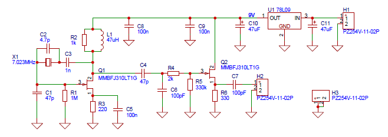
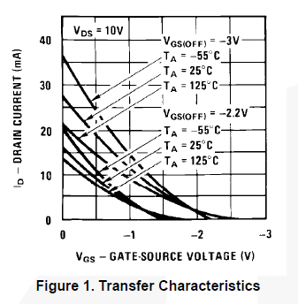
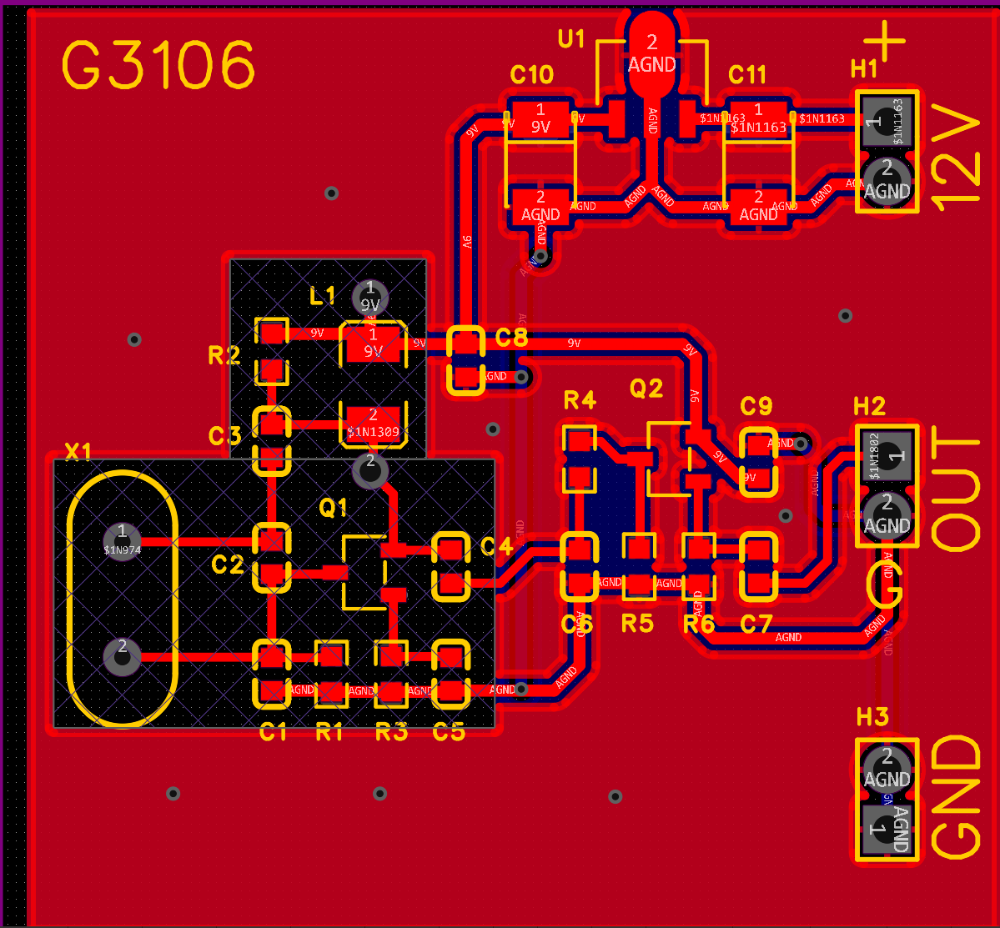

# G3106 晶体振荡器设计笔记

## 设计目标

为环形混频器提供本振信号。因为NE602已经停产很多年了，市面上无法正常买到，所以打算尝试用四个JFET构成的环形混频器，为此需要一个0.5-1Vpp的本地振荡器。VFO不是一个合理的选择，Si5351会是另一块板子（或者直接使用现成的Adfruit的板子），所以我们需要一块晶体振荡器的板子。

期待工作频率是业余电台的HF和6m，首先考虑用于7MHz频段，这样对器件选择会比较容易。

设计电路程式为一级振荡加一级跟随。

## 晶体管的选择与电路程式

### 振荡级

振荡晶体管选择JFET，因为栅极不取电流，flicker 拐点低于 7 MHz，−120dBc/Hz@1kHz 很容易，相较于BJT和MOSFET能实现较低相位噪声。

为此需采用9V供电， 因为7 MHz Pierce 振荡器需要足够高的“漏极摆幅”才能同时满足：

1. 振幅 ≥ 1 Vpp；
2. 晶振驱动电平 100 µW 左右（7 MHz 49S 晶体典型值），太低会启振困难、相位噪声变差；
3. 最终输出 +10 dBm（2 Vpp/50 Ω），若电源太低，缓冲级增益不够，还得再加一级放大。

由此，选择皮尔斯（Pierce）振荡电路，理由如下：

1. 晶体工作方式最合理
   皮尔斯电路让晶体工作在“串联谐振”附近，等效为低阻抗选频元件；考毕兹把晶体并接在槽路里，相当于让晶体呈“电感”去参与 LC 谐振。7 MHz 基频晶体在串联谐振点阻抗最低、Q 值最高，皮尔斯方式能直接利用这一特性，频率稳定度最好；
2. JFET 的高输入阻抗被充分利用
   皮尔斯把晶体接在栅极回路，JFET 的 10 MΩ 级输入阻抗几乎不加载晶体，维持高 Q；考毕兹若用 JFET 共源共栅结构，晶体两端往往并接电容分压器，等效负载重，7 MHz 时 Q 值下降明显；

采用 J310，即MMBTJ310，指标如下：

- $f_T ≈ 450MHz$，$g_m ≈ 12 mS$（$@ I_D = 10 mA$）
- 7 MHz 时 $|y_{fs}| ≈ 12 mS$，共源放大器增益 $≈ g_m · R_D$ ≈ 30–40 倍（30–32 dB）
- Pierce 环路只要 ≥ 3 dB 增益就能启振，余量 10 倍
- $V_{GS}(off) \approx -2 \dots -6.5V$，范围很宽，器件离散性大
- $I_{DSS}\approx 12 \dots 60mA$，范围很宽，器件离散性大
- $g_{fs}=12mS\ min$
- D、S极可互换

如果采用差一点的管子，如 J308、J309，振荡增益会下降3到6dB，采用2N3819，增益下降10dB，且噪声增大。

### 跟随级

单管 JFET 晶体振荡器必须加缓冲，再送混频器。直接硬连，轻则本振牵频、增益不稳，重则本振随天线收到的信号变化。

一、为什么一定要缓冲

1. 牵频（pulling）：混频器 4 只 JFET 的栅极是非线性时变负载，其输入阻抗在 0.5 个周期内从$\infty$ 变到几百欧。振荡管直接看过去，相当于“每微秒被踹一脚”，频率被踹得乱跳，典型 20–200 Hz 的抖动，CW 听起来像“鸟叫”。
   
2. 负载 Q 值崩塌：振荡回路本来 Q≈50–80，一接上低阻负载，Q 瞬间掉到 10 以下，幅度塌、相位噪声升、甚至停振。
   
3. 反向泄漏：天线口来的强信号（广播、CW 大功率）会沿混频器→本振口→晶体，反向窜进振荡管，形成“注入锁”——你听到的是别人的信号，不是 600 Hz 差频。

一级 JFET 源随器指标：  

- 输入电容 < 5 pF，对槽路影响可忽略  
- 电压增益 ≈ 0.9，功率隔离 > 20 dB  
- 输出阻抗 ≈ 200 Ω，正好给四管混频器当“软驱动”  

## 电路与元件计算

### 振荡级

#### 晶体管的工作点

在 JFET 晶体振荡器的原始设计中，源极是直接接地的，这样 $V_{GS}$ 就是0V。但是JFET的离散性很大，主要体现在漏极电流 $I_{DS}$ 和关断电压 $V_{GS}(off)$。为了让管子工作在线性区，产生的信号频谱最好，减少谐波分量，在源极和地之间接电阻R3，同时并联C5保证交流通路。有条件的话，最好在焊上板子之前对单个管子做上述两个参数的测量，以及 $V_{GS}$ 和 $I_{DS}$ 之间的关系曲线，从而确定源极电阻R3的值。没有条件的话，也可以参考器件手册上的曲线来做设计。实验条件下也可以先在R3接4.7k可变电阻，通过观察输出波形或频谱来确定R3的值。

以器件手册中的上图为例。常见 J310 的关断电压在-2.2V左右，取-2.2V/25C的曲线计算，期望静态工作电压在 -1V，因为$V_G=0V$，那么 $V_S=1V$，此时 $I_D$ 约 3mA。$R3=\cfrac{1V}{3mA}=330\ohm$。 

#### 漏极RFC

RFC L1的任务是对振荡频率（ 7 MHz） 呈现“开路”，对直流呈现“短路”。RFC电感量计算的经验公式是：

$X_L\geqslant 10\times Z_{tank}$

这里 $Z_{tank}$ 是晶体端看回去的等效并联阻抗，小功率JFET振荡器中，典型值为 1 kΩ–3 kΩ。取10倍是为了让RFC分流小于等于1/10，不影响Q值。

7MHz时，$L_z\geqslant \cfrac{10\times Z_{tank}}{2\pi f}=\cfrac{10\times2000}{2\pi\times 7\times 10^6}\approx 45\mu H$

所以L1取 $47\mu H$。

1008/1210封装的绕线电感，SRF为26~35MHz，Q≈50–70，可以用于7MHz的振荡。

叠层电感的SRF不高，Q很低，不适合这个场合。

RFC并联的电阻R2，是为了降低电感的Q，抑制空载升压，给漏极一个可控的负载，使相位-幅度条件稳定，把输出的Vpp降低到合适的位置。这个电阻可以进一步降低到330 Ω 。还可以在回路上串联一个100 Ω 电阻。

#### 栅极电阻R1

经典电路采用10M，从保证起振的角度，用1M比较合适，也可以下降到100k，但对信号没什么影响。

JFET 栅极几乎零电流，Rg 唯一任务：

1. 给栅极一个确定的直流参考（= 0 V，源极接地时）；
2. 泄放耦合电容/晶体上的静电、潮气、焊剂漏电积累的电荷；
3. 与 Ciss 形成高通极点，决定低频断点 f ≈ 1/(2π·Rg·Ciss)。

#### 栅极电容C1

这是“栅极射频对地电容”，作用＝给 FET 的栅极提供一个本地 RF 短路面，把 7 MHz 高频“锚”在晶体回路里，防止栅极引线电感把振荡器变成 VCO，容量按“比晶体并联电容 C0 大 3–10 倍”取就行，22–100 pF 都常见，不必精算。

1. 栅极对地本来已有 2–4 pF 的 Ciss，再加上 10 mm 引线的 15 nH 电感，会在 100 MHz 附近形成一个串联谐振点；
2. 晶体并联电容 C0 仅 2–5 pF，如果栅极“悬空”，这个寄生串联回路就把 7 MHz 的相位条件搬到别处，轻则起振困难，重则跳到晶体的三次泛音（21 MHz）；
3. 并一只 47 pF，人为把栅极在 7 MHz 处拉到 0 Ω（≈ 45 Ω 容抗），寄生电感被“短路”，环路相位只由晶体管，频率就老实呆在 7023 kHz。

容量怎么选：

- 最小值：≥ 3 × C0（晶体并联电容）
  C0 ≈ 4 pF → 3 × 4 pF ≈ 12 pF
- 常用值：22 pF、33 pF、47 pF、68 pF
- 上限：≤ 220 pF
  再大会把晶体“过阻尼”，Q 值下降，幅度减小，且栅极 RF 电压太低，跨导利用率下降。

这个电容在频率回路中，需要用C0G或NP0电容。

#### 漏极电容C3

这是“反馈耦合电容”，把晶体的高频电流送到漏极，形成“并联共振型”Pierce 回路，同时把漏极的直流高压挡在晶体外面。

容量按 “在 7 MHz 处阻抗 ≤ 几十欧，又远大于晶体 C0” 的原则取——1 nF 是经验甜点，可用范围 220 pF–4.7 nF，不必精算，实际实验发现范围内的容量对信号无影响。

它的作用是：

1. 直流隔离：漏极 sits 在 +9 V，栅极 0 V，没有这只电容，晶体金属壳会被拉偏到 4–5 V，长期会减寿命。
2. 交流反馈：漏极电压反相 180°，经 C 后→晶体→栅极，再补 180°，环路总相移 360°，满足巴克豪森条件。
3. 限抗：容抗 XC ≪ 晶体等效串联电阻 Rs（≈20–50 Ω），否则反馈幅度被吃掉，起振困难。

容量验算：
f = 7 MHz → XC = 1/(2πfC)
C = 1 nF → XC ≈ 23 Ω
23 Ω 比 Rs 小一倍，比槽路阻抗（kΩ 级）更是微不足道，能量几乎无损地送回栅极，同时 1 nF 对 9 V 直流≈开路，隔离完成。

#### 晶体并联电容C2

这个电容是为了把振荡频率调整到所需的频率上。例如，不接C2时振荡频率为7024.5kHz，希望实现7023.5kHz，那么$\Delta f = –1000 Hz$，而$f_0=7024.5kHz$，牵引量=-142ppm。根据晶体并联牵引公式：

$\cfrac{\Delta f}{f_0}\approx \cfrac{-C_p}{2\times C_0}$

而 $C_0\approx 4pF$，那么 $C_p\approx 2\times C_0\times \cfrac{|\Delta f|}{f_0}\approx 2\times 4pF\times 0.000142\approx 1.1pF$

受PCB分布电容（2~3pF）影响，实际需要2~4pF电容，图中的4.7pF是实验所得数值。

### 跟随级

级间耦合：C4、C6、R4、R5构成了振荡级到跟随级的级间耦合。C4和C5构成了交流分压电路，将振荡级的输出削减后送入跟随级。

Q2的静态点位，R5、R6的计算与Q1相同。

## PCB

PCB基本直接按照电路图布局和走线，振荡级不敷铜。

